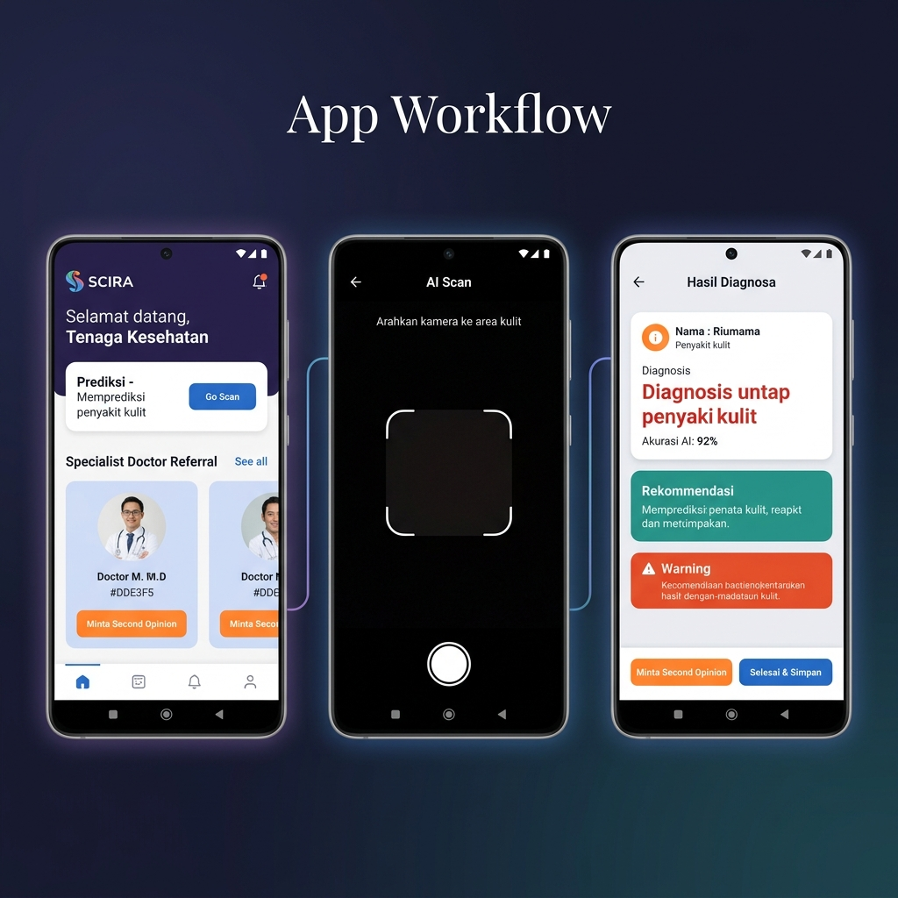

# HSIL Hackathon: AI Medical Diagnostic Tool

## Description / Overview
This project is a secure, offline-first Android application designed specifically to empower frontline health workers (*Nakes*). It serves as an advanced clinical decision support system to assist in diagnosing tropical and non-tropical diseases. By running Machine Learning models directly on the device, it provides rapid, reliable assessments even in areas with low or no internet connectivity. The application is built with a strong emphasis on data security, strictly adhering to ISO 27001 standards and Indonesian Personal Data Protection (UU PDP) laws.

## Demo

<p align="center">
  
</p>

## Installation
To set up and run this project locally, follow these steps:
1. Clone the repository:
   ```bash
   git clone https://github.com/your-username/hsilhackathon.git
   ```
2. Open the project in **Android Studio**.
3. Allow Gradle to sync and download all necessary dependencies.
4. Build and Run the application on a physical Android device or an emulator equipped with camera capabilities.

## Usage
1. **Health Worker Login**: Secure authentication for authorized *Nakes*.
2. **Informed Consent**: A mandatory patient consent workflow must be completed prior to any data collection.
3. **AI Scan (CameraX)**: Utilize the in-app camera to capture images of skin conditions. The app performs real-time AI image analysis. *(Note: Scans with a confidence score below 50% will prompt the user for a retake).*
4. **Dynamic Questionnaire**: Complete an adaptive clinical questionnaire that branches based on the AI's initial visual prediction (e.g., differentiating between *Bercak Merah* and *Bintil Merah*).
5. **Final Assessment**: The app seamlessly aggregates the visual CNN output with the questionnaire data into a Random Forest model to generate a structured diagnostic recommendation.

## Features
*   **Offline-First Native Android Architecture**: Fully functional in remote environments without an active internet connection.
*   **Edge AI Diagnostics**:
    *   **CNN (TensorFlow Lite)**: For powerful, real-time visual image analysis.
    *   **Random Forest (ONNX)**: For logical clinical decision support and synthesizing final diagnoses.
*   **Enterprise-Grade Security & Privacy**:
    *   Local database encryption using **Room + SQLCipher**.
    *   Cryptographic key management via **Android Keystore**.
    *   ISO 27001 & UU PDP compliant workflows, featuring comprehensive audit logging and secure data access.
*   **Dynamic Workflows**: Smart, context-aware clinical screening questionnaires.
*   **Telemedicine Referral Ready**: Architecture supports secure syncing and referrals to specialists when connectivity is restored.

## Tech Stack / Built With
*   **Language**: Kotlin
*   **Platform**: Android SDK
*   **AI/ML**: TensorFlow Lite (TFLite), ONNX Runtime, CameraX
*   **Local Storage**: Room Database, SQLCipher
*   **Security Tools**: Android Keystore, SSL Pinning

## Contributors
| Name | Role | GitHub |
|------|------|--------|
| **RavelGS** | AI Implementation & Model Integration | [](https://github.com/RavelGS) |
| **tyawaa** | Frontend & Backend Data Integration | [](https://github.com/tyawaa) |
| **RizzCode10** | UI / UX Design & Workflows | [](https://github.com/RizzCode10) |
